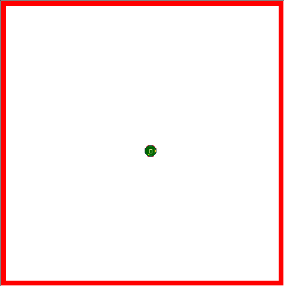
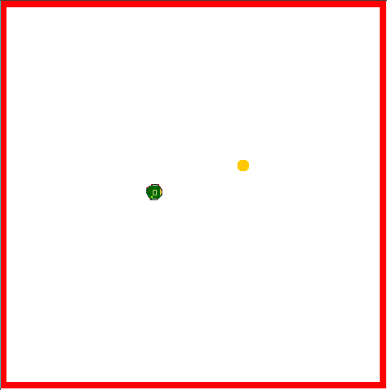
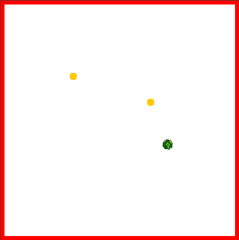
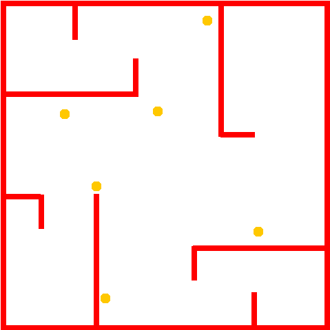
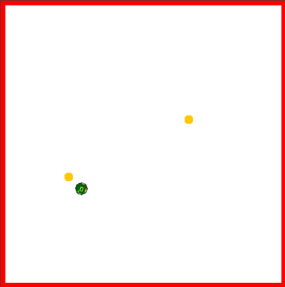

# Modified-WSU-Khepera-Simulator
A slightly modified version of the WSU Khepera Robot Simulator with custom controllers that implement the first four vehicles in Braitenburg's Vehicles.

# Installation and Running

In order to run this program, you must [install Java 18](https://www.codejava.net/java-se/install-oracle-jdk-18-on-windows).  Then download this repository, and run the ´run.sh´ script to start the program.

# Differences between Khepera Robot and Braitenburg Vehicles 
The Khepera Robot has eight light and distance sensors arranged around the robot.  Two look forward, two sideways, two backward, and two diagonally forward.  In order to simulate the two omnidirectional light sensors in the Braitenburg Vehicles, I average the light value from each of the sensors on each side of the robot.

As a result, whereas in the Braitenburg vehicles, both sensors will be activated even if the light source is on one side of the robot, in this implementation of the vehicles, only the sensors on one side will be activated.  In addition, the robot has a blind spot diagonally behind it that can cause the vehicle to slow down at unexpected times (this is most evident in vehicle 1).

In the WSU Khepera Robot Simulator, whenever the robot crashes into an object, the simulation stops.  As a result, to prevent the simulation from constantly crashing, each vehicle is programmed to overwrite its default behavior if it comes too close to a wall and to turn 180 degrees, though it sometimes overshoots the 180 degrees slightly.  This doesn't fix everything as the robot can still get stuck or accidentally run into walls sometimes, but it generally does a decent job at keeping the robot from crashing so that its behaviors can be observed for a longer amount of time.

Also, the robot simulator often lags quite a bit unless the mouse is constantly moving withing the application.  Why?  I don't know.  But it adds varition to the vehicles' behaviors by causing it to only adjust its course at uneven intervals, causing it to sometimes overshoot things.  This variation was taken to be part of the vehicles' behaviors.  In general, the same effect could be acheived in a more accurate robot simulator by having the robot only adjust the speed of its motors at slightly random intervals rather than at constant intervals.

# Explanation of Each Vehicle

## Vehicle 1

This vehicle has a single light sensor connected to both motors.  The brighter the light, the faster the robot goes.

## Vehicle 2a

This vehicle has two light sensors and two motors.  The left sensor is connected to the left motor, and vice versa.  The motor speed is directly proportional to the sensor value.

## Vehicle 2b

Like 2a, this vehicle has two light sensors and two motors, and the motor speed is directly proportional to the sensor value.  However, the left sensor is connected to the right motor, and vice versa.  

## Vehicle 3a

Like 2a, this vehicle has two light sensors and two motors, and the left sensor is connected to the left motor, and vice versa.  However, the motor speed is inversely proportional to the senor value. 

Note that the relationship between the sensor activation and the speed of the motors is `a / (activation / b)` where `a` determines the maximum speed when there is no light, and `b` determines how close the vehicle can get to the light.  In this case, `b` is tuned to allow the robot to get close enough to the light for the collision prevention mechanism to kick in, making the behavior be more interesting to watch than a pure implementation of Vehicle 3a would be.  But with a smaller value for `b`, the vehicle will just stop next to the light without turning around, which is what the pure Braitenburg vehicle would do.

## Vehicle 3b

Like 3a, this vehicle has two light sensors and two motors, and the motor speed is inversely proportional to the sensor value.  However, the left sensor is connected to the right motor, and vice versa.

## Vehicle 3c

This vehicle has two light sensors, two distance sensors, and two motors.  The left light sensor is connected to the left motor, and vice versa.  But the left distance sensor is connected to the right motor and vice versa.  So, the light sensors are parallel connected to the motors, and the distance sensors are cross connected. Like 3a, the motor speed is inversely proportional to the total sensor value, and the total sensor value is simply the sum of the values of both connected wires.

## Vehicle 3d

Similar to 3c, but the light sensors are also cross-connected.

Like 3c, this vehicle has two light sensors, two distance sensors, and two motors.  Also, the motor speed is inversely proportional to the total sensor value, and the total sensor value is simply the sum of the values of both connected wires.  However, the left light sensor is connected to the right motor, and vice versa.  And the left distance sensor is also connected to the right motor and vice versa.  So both sensors are cross connected to the motors. 

## Vehicle 4a

Like 3a, this vehicle has two light sensors and two motors.  The left sensor is connected to the left motor, and vice versa.  However, instead of the motor speed being inversely proportional or directly proportional to the sensor value, the relationship is determined by an activation function.  

This activation function can be anything for class 4 vehicles.  However, all class 4 vehicles given in these examples have the same activation function.  In this case, the activation function is a bell curve with μ = 7, σ = 4, and then scaled by a factor of 90.  Thus, when the sensor activation is 0, the motor speed is about 2; when the activation is 7, the motor reaches its maximum speed of about 9, and wen the activation is 20, the motor speed is about 0.

## Vehicle 4b

Like 4a, this vehicle has two light sensors and two motors.  And, instead of the motor speed being inversely proportional or directly proportional to the sensor value, the relationship is determined by an activation function.  However, now the left sensor is connected to the right motor, and vice versa.  

The activation function in this case, as with 4a, is a bell curve with μ = 7, σ = 4, and then scaled by a factor of 90.  Thus, when the sensor activation is 0, the motor speed is about 2; when the activation is 7, the motor reaches its maximum speed of about 9, and wen the activation is 20, the motor speed is about 0.

## Vehicle 4c

Like 3c, this vehicle has two light sensors, two distance sensors, and two motors.  Like 4a, instead of the motor speed being inversely proportional or directly proportional to the sensor value, the relationship is determined by an activation function.  Also, the left light sensor is connected to the left motor, and vice versa.  However, the left distance sensor is connected to the left motor and vice versa.  Thus, the light sensors and distance sensors are both parallel connected.

The activation function in this case, as with 4a, is a bell curve with μ = 7, σ = 4, and then scaled by a factor of 90.  Thus, when the sensor activation is 0, the motor speed is about 2; when the activation is 7, the motor reaches its maximum speed of about 9, and wen the activation is 20, the motor speed is about 0.

## Vehicle 4d

Similar to 4b, but with cross-connected distance sensors in addition to the light sensors.

Like 3c, this vehicle has two light sensors, two distance sensors, and two motors.  Like 4b, instead of the motor speed being inversely proportional or directly proportional to the sensor value, the relationship is determined by an activation function.  Also, the left light sensor is connected to the right motor, and vice versa.  However, like 4c, the left distance sensor is connected to the left motor and vice versa.  Thus, the light sensors are cross connected, and the distance sensors are parallel connected.

The activation function in this case, as with 4a, is a bell curve with μ = 7, σ = 4, and then scaled by a factor of 90.  Thus, when the sensor activation is 0, the motor speed is about 2; when the activation is 7, the motor reaches its maximum speed of about 9, and wen the activation is 20, the motor speed is about 0.

# Maps

## Map 1 - Null Map

This is an empty map.

## Map 2 - Single Light Source

This map contains a single light source above and to the right of the robot's default spawn point.

## Map 3 - Double Light Source

This map contains two light sources, one above and to the right of the robot's default spawn point, and the other above and to the left of the spawn point.

## Map 4 - Vehicle 2a Hide from Light

This map contains multiple light sources and several corridors in which the robot can hide from the light.

## Map 5 - Double Light Sources at a Distance

This map contains two light sources at a greater distance apart than in Map 3.

## Map 6 - Find the Light

This map contains multiple corridors each hiding a light source.

## Map 7 - Everybody Dance Now... Sorry

This map contains a small box around where the robot spawns with one light source in it.  It's main purpose is to showcase the dancing behavior of Vehicle 3a (see below).

## Map 8 - Thread the Needle

This map contains a horizontal wall with a small opening near the top of the screen a five light sources arranged in a squashed, upside-down pentagon with the tip of the pentagon directly opposite the opening in the gate and the rest of the light sources symmetrically placed on either side of the opening.

# Vehicle Behaviors

## Vehicle 1

The behavior of vehicle one is quite simple.  It moves in a perfectly straight line (except when it turns around to avoid a wall), and it speeds up as it gets closer to light.

Map 2, containing a single light source, easily demonstrates this behavior as the robot will slowly increase in speed as it gets closer to the light source and slow down as it passes it.  One caviot to note it that it slows down quite a bit when it first passes the light and then speeds up a bit as it gets further from it.  This is because the robot has two blind spots at an angle behing it.  Whereas there are four forward-facing sensors, there are only two backward facing sensors which are both pointed straight back.

Map 1 also shows how the vehicle doesn't move when there is no light source.  So, one might say that the vehicle gets excited by the presence of light and dies of boredom when there is no light around.  Other than that, it's pretty stupid as it doesn't attempt to track down the light, but it instead only moves in a straight line except when it gets close to a wall and turns around.  In fact, the only reason it can move in any other line than the line of motion that it started out following is because of a lazily engineered system for having it turn 180 degrees whenever it gets close to a wall that causes it to actually turn slightly more or less than 180 degrees sometimes.

## Vehicle 2a

Vehicle 2a fears light and is rather lazy.  As demonstrated by Map 2, this vehicle moves faster the closer it is to light, but it always tries to run away from light.  As demonstrated by Map 1, its preferred pass-time is sleeping.  But if it sees any light, it will try to get as far away from it as possible.

Because of the hard-coded wall-avoiding behavior, in Map 2, this poor vehicle often finds itself struggling to move away from the light only to bounce off the wall back toward the light.  As a result, it gets stuck in a loop of lazily wandering toward a wall, then heading toward the intimidating light, then staggering to turn around only to bump into a wall and repeat the pattern.

In Map 3, if the vehicle is placed above the two light sources, a more anxious and energetic side of the robot comes out.  Due to the increased brightness and proximity of the lights to the walls, the vehicle finds itself trapped between the evil gaze of the lights and the impenetrable barrier of the walls.  This time, the pattern of bumping into walls and turning around happens faster and with shorter loops.  Often, the robot gets stuck in a weird position where it's traveling nearly parallel to the wall close enough to activate the 180-degree-turn behavior.  But since it's not heading away from the wall fast enough, it immediately retriggers the turning behavior, causing it to turn in place for circles.  Sometimes, however, it does manage to slightly break free of this seizurelike behavior and make progress traveling along the wall away from the light until it gets stuck again in the corner.

Map 4 also demonstrates Vehicle 2a's anxious behavior in the presence of multiple lights, but this time there are safe areas that the robot can hide in.  Should it be lucky enough to wander into one (something which seems to happen very rarely, though has happened at least once), it will at last get to rest from running away from the lights.  However, while it's incompetence doesn't quite level up to Vehicle 1's incompetence, it's still not particularly clever as it rarely finds the shelter.  Granted, it doesn't help that this vehicle literally can't see walls, but it still seems to think that falling into restless patterns of traveling between two points without every making progress is a good strategy for running away from light sources.

## Vehicle 2b

Like the last vehicle, Vehicle 2b hates light and just wants peace and darkness.  However, unlike Vehicle 2a, as demonstrated by Map 2, this vehicle's strategy is to take out its frustration on the light sources by ramming into them top speed, sometimes multiple times before running away to try to find peace and quiet.

In Map 3, it's all out war.  The vehicle travels back and forth between the two light sources attacking each one without rest.  In Map 5, with the light sources farther apart, the vehicle is more likely to attack each light source multiple times in a row before running the second one down.  In addition, it occasionally seems to start running away from the fight to find darkness, but it quickly changes it mind and rushes down the second light.

In Map 4, the Vehicle does sometimes manage to find its way into one of the shelters, but it grows frusterated by the ever-present light before it finds the part of the shelter where there's total shade, and it instead leaves the shelter to attack the light again.

## Vehicle 3a

Vehicle 3a is an explorer and admirer of the beautiful/bright.  As Map 1 shows, this vehicle likes to travel quickly in a straight line seeking out some new light source to admire.  And while traveling in a straight line generally isn't the greatest strategy to find something, once it does detect light, it straightway turns toward the light and slowly approaches it, as demonstrated by Map 2.  Upon getting close to the light, the robot slows to a stop, as if admiring its beauty.  But once it gets close enough that the turning mechanism is triggered, the robot decides it has seen enough and journeys on to see if there there are any more lights.

In Maps 3 and 5, its quest to meet other lights is met with success, and it likewise admires the second light source until it grows bored of it.  Sometimes it will head right back to the other light afterward.  Other times, it will start heading in a random direction before being lured by the other light.  And sometimes, it will learn to be content with the light it has found and lie down to bask in its light for the rest of eternity.

Map 4 demonstrates just how indecisive this little robot is.  When it's surrounded by too many lights, it completely freezes up, unable to decide wich light to follow.  Or perhaps it feels that getting any closer to a light would overwhelm it with beauty, and it would prefer to stay a safe distance away.  Either way, since this robot slows down as it approaches light, if there's too much brightness around, it won't be able to get close enough to any light source to trigger the turning around mechanism. 

Map 6 demonstrates both this vehicles ability and inability to find light sources.  The first unexpected thing this map reveals about the vehicle is that even when the light source is clearly withing view, the vehicle doesn't start heading toward it unless it's close enough to it.  This is because the speed of each motor can only have a value between -9 and +9, and the speed of this motor is determinted by `k / activation` where `activation` is the value of the light sensor and `k` is some proportionality constant (90 in this case).  If the constant is too high, when the robot is any significant distance from the light source, the equation will give a value higher than 9.  Typically, what happens if the robot is traveling perpendicular to a light source is that the light sensor on the side closer to the light will read a higher value than the one on the other side (or in the case of this implementation of the Braitenburg vehicles, the sensor on the other side will read zero).  As a result, the motor on the far side continues at top speed while the motor on the other side will have a smaller speed, which causes the robot to turn toward the light.  However, if the robot is far enough from the light source, and if `k` is too big, the even if the activation on the one side of the robot is stronger, `k / activation` will still be greater than 9, so both motors would just default to top speed, making it go straight ahead.

So the solution would be to decrease the value of `k`.  However, that then leads to another problem where the robot will stop before it gets very close to the light source.  This is because `k / activation` will now get closer to zero even for higher sensor activation values.  Thus, I had to choose between a high value of `k` which would lead to the vehicle not turing toward light sources unless it's really close to them, or a low value of `k` that would lead to the vehicle not getting close enough to the light to trigger the turing around mechanism which makes this vehicle actually interesting to watch.  I opted for the latter.

All that to say, in Map 6, this vehicle takes much longer than expected to actually notice a light source.  But then, when it does, it will start heading toward it.  It still takes a while as it bounces back and forth off various walls, but it starts to slowly make progress toward the light.  Then, once it gets to the light, it follows its familiar pattern of crawling closer and then turning away.

However, because the walls are now so close, the vehicle quicly finds itself heading straight back to the same light and seems to engage in some sort of ritualistic dancing around the light.  Often, after dancing around the light source for a bit, it will come to rest right in front of the light source where it will forever admire its beauty.  Other times, it will reverse direction and dance around it the other way.  And sometimes it will get tired of dancing after a while and head toward another light source.

As a matter of fact, this dancing motion can also be seen in Map 2, though it's less pronounced since the walls are so far apart.  Map 7 was designed to better observe this vehicle's dancing motions.  Interestingly, whether the robot starts dancing clockwise or counter-clockwise around the light source seems to be pretty much random, as is when it decides to stop and when it decides to reverse directions.  And while it changes direction a lot, it sometimes will prefer one direction over another, causing it to eventually dance a full circle around the light source, despite occasionally reversing direction while doing so. 

## Vehicle 3b

